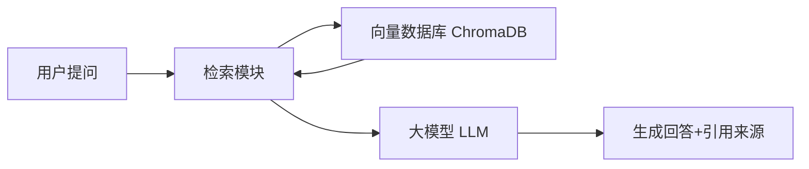

# 个人知识库 AI 助手 — 第一周实施计划（Windows 适配版）

> **本计划所有命令均已适配 Windows 环境**（cmd 和 PowerShell 双兼容）
> **系统路径**：所有文件均创建在 `D:\learn\chat\ai-assistant\` 下

---

## 项目概览

构建一个 RAG（检索增强生成）系统，让 AI 能基于你收集的文档回答问题。第一周的目标是**跑通完整链路**：用户提问 → 检索相关文档 → 大模型生成回答 → 展示在网页上。

---

## 技术选型

| 组件 | 选择 | 原因 |
|------|------|------|
| 编程语言 | Python 3.10+ | AI 生态最强，LangChain/Hugging Face 等库支持最好 |
| LLM | GPT-4o-mini / DeepSeek API | 便宜、效果好，调试阶段推荐用 API |
| 本地备选 | Ollama + qwen2.5 7B | 零成本，效果稍差但可离线调试 |
| RAG 框架 | LlamaIndex（首选） | 比 LangChain 更专注 RAG 场景，上手更快，文档好 |
| 向量数据库 | ChromaDB | 本地运行，零配置，够用 |
| 文档解析 | Unstructured / PyMuPDF | 支持 PDF、Markdown、HTML、代码等格式 |
| Embedding | BAAI/bge-small-zh-v1.5 | 中文效果好，体积小，免费 |
| 前端 | Streamlit | 最快速搭建 Demo，纯 Python，一天搞定 |
| 包管理 | uv / pip | 推荐 uv（更快），pip 也可 |

---

## 📁 项目目录结构（最终效果）

所有文件第 7 天时应该长这样：

```
D:\learn\chat\ai-assistant\
├── .env                     ← 你的 API 密钥（手动创建，不提交 Git）
├── .gitignore               ← Git 忽略规则（自动生成）
├── requirements.txt         ← 项目依赖（第 7 天生成）
├── README.md                ← 项目文档（第 7 天写）
│
├── hello_llm.py             ← Day 1：测试 API 调用
├── ingest.py                ← Day 2→4：文档入库脚本
├── query.py                 ← Day 3：命令行问答
├── app.py                   ← Day 5：Web 界面
│
├── data/                    ← 你的文档放这里
│   ├── sample.md            ← Day 2 测试文档
│   └── 你的笔记.pdf          ← Day 4 你自己的 PDF
│
├── storage/                 ← 向量数据库（自动生成，不提交 Git）
│   └── chroma_db/
│
└── .venv/                   ← Python 虚拟环境（自动生成，不提交 Git）
```

---

## 每日计划

### Day 1：环境搭建 + Hello World

**目标**：跑通大模型 API 调用，确认环境正常

```
📄 本日会创建的文件：
   D:\learn\chat\ai-assistant\.env        ← API Key
   D:\learn\chat\ai-assistant\hello_llm.py ← 测试脚本
   D:\learn\chat\ai-assistant\requirements.txt ← 依赖清单
   D:\learn\chat\ai-assistant\.venv\      ← 虚拟环境（目录）
```

#### 具体步骤

1. **打开终端**
   - 按 `Win + R` → 输入 `cmd` → 回车
   - 或：在 `D:\learn\chat` 文件夹里按住 Shift 右键 → "在此处打开 PowerShell 窗口"

2. **创建项目目录**

```cmd
:: 创建项目文件夹
mkdir D:\learn\chat\ai-assistant

:: 进入项目文件夹
cd /d D:\learn\chat\ai-assistant
```

   > 💡 `cd /d` 可以切换到不同盘符的目录。你也可以直接在文件夹地址栏输入 `cmd` 回车，路径会自动定位。

3. **创建虚拟环境并安装依赖**

```cmd
:: 创建虚拟环境（会在当前目录生成 .venv 文件夹）
python -m venv .venv

:: 激活虚拟环境（重要！每次新开终端都要执行这一步）
.venv\Scripts\activate

:: 如果报"执行策略限制"，先执行（仅首次需要）：
:: PowerShell: Set-ExecutionPolicy -ExecutionPolicy RemoteSigned -Scope CurrentUser
:: cmd 不需要这步

:: 安装依赖
pip install python-dotenv openai
```

   > 💡 **虚拟环境说明**：
   > - `.venv` 文件夹在哪，虚拟环境就在哪
   > - 激活后终端前面会显示 `(.venv)` 标志
   > - 每次新开 cmd 窗口都要重新执行 `.venv\Scripts\activate`
   > - 退出虚拟环境命令：`deactivate`

4. **配置 API Key**

   在 `D:\learn\chat\ai-assistant\` 目录下新建文件 `.env`

   > **Windows 上创建 `.env` 的方法**：
   > - **VS Code**：在文件夹右键 → 新建文件 → 输入 `.env` 回车
   > - **记事本**：新建文本文件 → 文件 → 另存为 → 文件名输入 `.env`（注意是 `.env` 不是 `.env.txt`）
   > - **cmd**：`echo LLM_API_KEY=你的key > .env`
   > - **PowerShell**：`New-Item .env`
   >
   > ⚠️ Windows 资源管理器可能不让你直接命名为 `.env`，用编辑器最省事

   **方式 A（推荐）** — 用 DeepSeek API（注册即送 500 万 tokens）：

```ini
# .env 文件内容 — 把 key 替换成你自己的
LLM_API_KEY=你的deepseek_api_key_粘贴在这里
LLM_BASE_URL=https://api.deepseek.com/v1
LLM_MODEL=deepseek-chat
```

   **方式 B** — 用 Ollama 本地模型（免费，不需要 API Key）：
   - 下载安装 [Ollama for Windows](https://ollama.com/download/windows)
   - 打开 cmd 执行：`ollama pull qwen2.5:7b`
   - `.env` 文件中设置 `LLM_MODEL=qwen2.5:7b`

5. **写测试脚本**

   创建 `D:\learn\chat\ai-assistant\hello_llm.py`：

```python
import os
from dotenv import load_dotenv
from openai import OpenAI

load_dotenv()

client = OpenAI(
    api_key=os.getenv("LLM_API_KEY"),
    base_url=os.getenv("LLM_BASE_URL", "https://api.deepseek.com/v1"),
)

response = client.chat.completions.create(
    model=os.getenv("LLM_MODEL", "deepseek-chat"),
    messages=[
        {"role": "system", "content": "你是个人知识库助手"},
        {"role": "user", "content": "请用一句话介绍你自己"},
    ],
    stream=False,
)

print(response.choices[0].message.content)
```

6. **验证运行**

   确保虚拟环境已激活（前面有 `(.venv)` 标志），然后：

```cmd
:: 在 D:\learn\chat\ai-assistant 目录下
python hello_llm.py
```

   ✅ 预期输出：AI 返回一句自我介绍，比如 "我是你的知识库助手..."

   > ❌ 如果报错 `ModuleNotFoundError: No module named 'openai'` → 说明你忘记激活虚拟环境了，执行 `.venv\Scripts\activate` 后再试

7. **Git 初始化**

```cmd
:: ----- Git 操作说明 -----
:: git init  ：把当前文件夹变成 Git 仓库，会生成 .git 文件夹（隐藏）
:: git add -A  ：把当前所有文件加到暂存区，准备提交
:: git commit -m "xxx"：把暂存区的文件正式提交，-m 后面是本次提交说明

:: 初始化 Git 仓库
git init

:: 创建 .gitignore（告诉 Git 哪些文件不要跟踪）
:: >  表示"写入新文件"
:: >> 表示"追加到文件末尾"
echo .venv/ > .gitignore
echo .env >> .gitignore
echo __pycache__/ >> .gitignore
echo storage/ >> .gitignore

:: 查看 .gitignore 内容确认
type .gitignore

:: 添加所有文件到暂存区并提交
git add -A
git commit -m "init: 项目初始化，跑通 LLM API"
:: 如果没配置 Git 用户信息，会提示你先设置：
::   git config --global user.name "你的名字"
::   git config --global user.email "你的邮箱@example.com"
```

   > 💡 **Git 提交时机**：建议每天完成目标后提交一次，养成习惯。查看历史提交：`git log --oneline`

#### ✅ Day 1 完成标志
- [ ] API 调用成功，控制台打印出 AI 回复
- [ ] `.env` 配置正确，代码不暴露密钥
- [ ] Git 仓库初始化，第一次提交成功
- [ ] 理解了虚拟环境的激活方法

---

### Day 2：文档加载 + 向量化存储

📖 **学习内容**：了解 Embedding 的概念、向量数据库的作用

**目标**：能将一个 PDF/Markdown 文件切分、向量化、存入 ChromaDB

```
📄 本日会创建的文件：
   D:\learn\chat\ai-assistant\ingest.py       ← 文档入库脚本
   D:\learn\chat\ai-assistant\data\sample.md  ← 测试文档
   D:\learn\chat\ai-assistant\storage\        ← 向量数据库（自动生成）
```

#### 具体步骤

1. **安装依赖**

```cmd
:: 确保虚拟环境已激活！（前面有 (.venv) 标志）
:: 如果还没激活：.venv\Scripts\activate

:: 安装所有 RAG 相关依赖
pip install llama-index
pip install llama-index-embeddings-huggingface
pip install llama-index-vector-stores-chroma
pip install chromadb
```

   > ⚠️ **Windows 注意事项**：
   > - cmd 粘贴快捷键：右键点击标题栏 → 编辑 → 粘贴，或直接 `Ctrl+V`
   > - PowerShell 使用 Tab 键可以自动补全路径和文件名
   > - 如果下载很慢，可以用国内镜像源：
   >   ```cmd
   >   pip install llama-index -i https://pypi.tuna.tsinghua.edu.cn/simple
   >   ```

2. **准备测试文档**

   创建 `D:\learn\chat\ai-assistant\data\sample.md`

   > 💡 创建 data 目录：`mkdir D:\learn\chat\ai-assistant\data`

```markdown
# Python 基础教程

## 变量与数据类型
Python 是动态类型语言。常见数据类型包括：
- int：整数，如 1, 100, -5
- float：浮点数，如 3.14, -0.5
- str：字符串，用引号包裹
- list：列表，用 [] 表示，可修改
- dict：字典，键值对，用 {} 表示

## 函数
使用 def 关键字定义函数：
```python
def greet(name):
    return f"Hello, {name}!"
```

## 列表推导式
一种简洁的创建列表方式：
```python
squares = [x**2 for x in range(10)]
```
```

3. **写文档入库脚本**

   创建 `D:\learn\chat\ai-assistant\ingest.py`：

```python
import os
from dotenv import load_dotenv
from llama_index.core import SimpleDirectoryReader, VectorStoreIndex, Settings
from llama_index.embeddings.huggingface import HuggingFaceEmbedding
from llama_index.vector_stores.chroma import ChromaVectorStore
import chromadb

load_dotenv()

# 1. 设置 Embedding 模型
Settings.embed_model = HuggingFaceEmbedding(
    model_name="BAAI/bge-small-zh-v1.5",
)

# 2. 初始化 ChromaDB（持久化存储）
db = chromadb.PersistentClient(path="./storage/chroma_db")
chroma_collection = db.get_or_create_collection("knowledge_base")
vector_store = ChromaVectorStore(chroma_collection=chroma_collection)

# 3. 读取文档
documents = SimpleDirectoryReader("data").load_data()
print(f"加载了 {len(documents)} 个文档")

# 4. 构建索引
index = VectorStoreIndex.from_documents(
    documents,
    vector_store=vector_store,
)

print("索引构建完成！")
print(f"文档已存入 ChromaDB，collection: knowledge_base")
```

4. **运行入库脚本**

```cmd
:: 确保在 D:\learn\chat\ai-assistant 目录下
:: 确保虚拟环境已激活

python ingest.py
```

   预期输出：
```
加载了 1 个文档
索引构建完成！
文档已存入 ChromaDB，collection: knowledge_base
```

   > ❌ 如果报错 `ModuleNotFoundError: No module named 'llama_index'` → 重新激活虚拟环境 `.venv\Scripts\activate` 并检查 `pip list`

5. **验证数据是否存入**

   创建 `D:\learn\chat\ai-assistant\verify.py`：

```python
import chromadb

db = chromadb.PersistentClient(path="./storage/chroma_db")
col = db.get_collection("knowledge_base")

print(f"文档数量: {col.count()}")

result = col.get(limit=1, include=["embeddings"])
if result["embeddings"] is not None and len(result["embeddings"]) > 0:
    print(f"向量维度: {len(result['embeddings'][0])}")
else:
    print("向量维度: 无法获取")
```

   然后运行：`python verify.py`

6. **Git 提交**

```cmd
:: 查看当前文件变化
git status

:: 添加并提交
git add -A
git commit -m "feat: 实现文档入库功能，支持 Markdown 语法"
```

#### ✅ Day 2 完成标志
- [ ] `ingest.py` 运行成功，文档写入向量库
- [ ] 验证脚本输出文档数量和向量维度（`bge-small-zh-v1.5` 是 512 维）
- [ ] 理解 Embedding 和向量数据库的基本概念
- [ ] Git 提交成功

---

### Day 3：简单 RAG 查询（命令行版）

📖 **学习内容**：理解检索 + 生成（Retrieve + Generate）的工作流

**目标**：写一个命令行脚本，提问后能基于文档回答

```
📄 本日会创建的文件：
   D:\learn\chat\ai-assistant\query.py ← 命令行查询
```

#### 具体步骤

1. **写查询脚本**

   创建 `D:\learn\chat\ai-assistant\query.py`：

```python
import os
from dotenv import load_dotenv
from llama_index.core import Settings, VectorStoreIndex
from llama_index.embeddings.huggingface import HuggingFaceEmbedding
from llama_index.vector_stores.chroma import ChromaVectorStore
from llama_index.llms.openai import OpenAI
import chromadb

load_dotenv()

# 1. 设置 Embedding 模型（必须和入库时一致）
Settings.embed_model = HuggingFaceEmbedding(
    model_name="BAAI/bge-small-zh-v1.5",
)

# 2. 设置 LLM（用 OpenAI 兼容接口调用 DeepSeek）
Settings.llm = OpenAI(
    api_key=os.getenv("LLM_API_KEY"),
    base_url=os.getenv("LLM_BASE_URL", "https://api.deepseek.com/v1"),
    model=os.getenv("LLM_MODEL", "deepseek-chat"),
)

# 3. 加载已有索引
db = chromadb.PersistentClient(path="./storage/chroma_db")
chroma_collection = db.get_collection("knowledge_base")
vector_store = ChromaVectorStore(chroma_collection=chroma_collection)
index = VectorStoreIndex.from_vector_store(vector_store)

# 4. 创建查询引擎
query_engine = index.as_query_engine(
    similarity_top_k=3,  # 检索最相似的 3 个文档片段
)

# 5. 交互式查询
print("🤖 知识库助手已启动！（输入 'quit' 退出）")
print("-" * 40)
while True:
    question = input("\n🙋 你的问题: ")
    if question.lower() in ("quit", "exit", "q"):
        break
    response = query_engine.query(question)
    print(f"\n🤖 回答: {response}")
    print(f"\n📎 参考来源: {len(response.source_nodes)} 个文档片段")
    for i, node in enumerate(response.source_nodes):
        print(f"  {i+1}. {node.node.get_text()[:100]}...")
```

2. **运行测试**

```cmd
:: 确保虚拟环境已激活
python query.py
```

   然后输入问题：`Python中如何定义函数？`

   ✅ 预期输出：能基于你 `sample.md` 中的内容回答，例如：
```
🤖 回答: 在 Python 中使用 def 关键字定义函数...
```

   > ❌ 如果回答明显是 AI 自己编的 → 检查 Embedding 模型是否和入库时一致，检查 data 目录里是否有文档

3. **测试不加 RAG 的区别**（理解 RAG 的价值）

   创建 `D:\learn\chat\ai-assistant\compare.py`：

```python
from openai import OpenAI
import os
from dotenv import load_dotenv

load_dotenv()
client = OpenAI(
    api_key=os.getenv("LLM_API_KEY"),
    base_url=os.getenv("LLM_BASE_URL"),
)
r = client.chat.completions.create(
    model=os.getenv("LLM_MODEL"),
    messages=[{"role": "user", "content": "Python列表推导式怎么写？你的回答只能用我知识库中的内容（但你并没有知识库，所以你应该说不知道）"}]
)
print(r.choices[0].message.content)
```

   运行：`python compare.py`

   对比有 RAG 和没 RAG 的差异——没 RAG 的 AI 会乱编，有 RAG 的会基于文档回答。

4. **Git 提交**

```cmd
git add -A
git commit -m "feat: 实现 RAG 查询，支持基于文档的命令行问答"
```

#### ✅ Day 3 完成标志
- [ ] `query.py` 能正确基于文档回答问题
- [ ] 给不相关的问题时，AI 应该诚实说不知道，而不是瞎编
- [ ] 理解 RAG 的基本流程：检索 → 增强 → 生成
- [ ] Git 提交

---

### Day 4：支持多文档 + PDF 解析

📖 **学习内容**：不同类型文档的解析挑战

**目标**：能处理 PDF，支持批量导入文档

```
📄 本日会新增/修改的文件：
   D:\learn\chat\ai-assistant\ingest.py     ← 升级版（支持 PDF）
   D:\learn\chat\ai-assistant\data\你的笔记.pdf ← 你自己的 PDF
```

#### 具体步骤

1. **安装 PDF 解析依赖**

```cmd
:: 确保虚拟环境已激活
pip install pypdf pymupdf
```

   > 💡 `pypdf` 是纯 Python 的 PDF 解析器，`pymupdf` 是 C 语言实现（更快），两个都装 LlamaIndex 会自动选择最佳方案。

2. **升级 `ingest.py`**

   把旧版 `ingest.py` **整体替换**为以下内容：

```python
import os
from dotenv import load_dotenv
from llama_index.core import SimpleDirectoryReader, VectorStoreIndex, Settings
from llama_index.core.node_parser import SentenceSplitter
from llama_index.embeddings.huggingface import HuggingFaceEmbedding
from llama_index.vector_stores.chroma import ChromaVectorStore
import chromadb

load_dotenv()

# Embedding 模型
Settings.embed_model = HuggingFaceEmbedding(
    model_name="BAAI/bge-small-zh-v1.5",
)

# 自定义分块策略（比默认更智能）
Settings.node_parser = SentenceSplitter(
    chunk_size=512,        # 每块字符数
    chunk_overlap=50,      # 块之间重叠 50 字，保持上下文连贯
)

# ChromaDB
db = chromadb.PersistentClient(path="./storage/chroma_db")
chroma_collection = db.get_or_create_collection("knowledge_base")
vector_store = ChromaVectorStore(chroma_collection=chroma_collection)

# 读取所有文档（递归搜索 data 目录）
documents = SimpleDirectoryReader(
    "data",
    recursive=True,         # 递归子目录
    filename_as_id=True,    # 用文件名当 ID
).load_data()

print(f"📄 共加载 {len(documents)} 个文档")

# 构建索引
index = VectorStoreIndex.from_documents(
    documents,
    vector_store=vector_store,
    show_progress=True,     # 显示进度条
)

print("✅ 索引构建完成！")
print(f"📊 向量库中文档数量: {chroma_collection.count()}")
```

3. **准备真实文档**
   - 找 2~3 份你有价值的 PDF 或笔记放到 `D:\learn\chat\ai-assistant\data\` 目录
   - 建议组合：一份教材章节、一份你自己的笔记、一份技术文档
   - 文件名可以用中文，没关系

4. **重新入库（会先清空旧数据）**

```cmd
:: 先删掉旧的向量库
rmdir /s /q storage

:: 重新入库
python ingest.py
```

   > ⚠️ `rmdir /s /q storage` 会彻底删除 `storage` 文件夹。

5. **用 query.py 测试新文档的问题**

```cmd
python query.py
```

   问一些 PDF 里的具体内容，看回答是否准确。

6. **Git 提交**

```cmd
git add -A
git commit -m "feat: 支持 PDF 和多文档入库，自定义分块策略"
```

#### ✅ Day 4 完成标志
- [ ] 支持 PDF 文档解析
- [ ] 支持批量导入 data/ 下的多个文档
- [ ] 分块策略可配置（chunk_size, chunk_overlap）
- [ ] 使用你自己真实的文档测试通过
- [ ] Git 提交

---

### Day 5：搭建 Web 界面

📖 **学习内容**：Streamlit 基础、前后端交互

**目标**：做一个简单的网页，输入问题、显示回答、展示引用来源

```
📄 本日会创建的文件：
   D:\learn\chat\ai-assistant\app.py ← Web 应用
```

#### 具体步骤

1. **安装 Streamlit**

```cmd
:: 确保虚拟环境已激活
pip install streamlit
```

2. **写 Web 应用**

   创建 `D:\learn\chat\ai-assistant\app.py`：

```python
import os
import streamlit as st
from dotenv import load_dotenv
from llama_index.core import Settings, VectorStoreIndex
from llama_index.embeddings.huggingface import HuggingFaceEmbedding
from llama_index.vector_stores.chroma import ChromaVectorStore
from llama_index.llms.openai import OpenAI
import chromadb

load_dotenv()

# ---------- 页面配置 ----------
st.set_page_config(
    page_title="📚 个人知识库助手",
    page_icon="📚",
    layout="wide",
)
st.title("📚 个人知识库 AI 助手")
st.markdown("基于你的文档回答问题，答案附带来源引用。")

# ---------- 初始化 ----------
@st.cache_resource
def init_engine():
    Settings.embed_model = HuggingFaceEmbedding(
        model_name="BAAI/bge-small-zh-v1.5",
    )
    Settings.llm = OpenAI(
        api_key=os.getenv("LLM_API_KEY"),
        base_url=os.getenv("LLM_BASE_URL", "https://api.deepseek.com/v1"),
        model=os.getenv("LLM_MODEL", "deepseek-chat"),
    )
    db = chromadb.PersistentClient(path="./storage/chroma_db")
    chroma_collection = db.get_collection("knowledge_base")
    vector_store = ChromaVectorStore(chroma_collection=chroma_collection)
    index = VectorStoreIndex.from_vector_store(vector_store)
    return index.as_query_engine(similarity_top_k=3)

query_engine = init_engine()

# ---------- 侧边栏 ----------
with st.sidebar:
    st.header("⚙️ 设置")
    st.info("当前知识库包含以下文档：\n")
    import glob
    files = glob.glob("data/**/*", recursive=True)
    files = [f for f in files if os.path.isfile(f)]
    for f in files:
        st.write(f"- {f}")
    st.divider()
    st.caption("知识库路径: ./storage/chroma_db")

# ---------- 主界面 ----------
if "messages" not in st.session_state:
    st.session_state.messages = []

for msg in st.session_state.messages:
    with st.chat_message(msg["role"]):
        st.markdown(msg["content"])
        if "sources" in msg:
            with st.expander("📎 参考来源"):
                for i, src in enumerate(msg["sources"]):
                    st.caption(f"来源 {i+1}")
                    st.text(src[:200])

if prompt := st.chat_input("输入你的问题..."):
    st.chat_message("user").markdown(prompt)
    st.session_state.messages.append({"role": "user", "content": prompt})

    with st.chat_message("assistant"):
        with st.spinner("正在检索知识库并生成回答..."):
            response = query_engine.query(prompt)
            st.markdown(str(response))

            sources = []
            for node in response.source_nodes:
                sources.append(node.node.get_text())

            with st.expander("📎 参考来源"):
                for i, src in enumerate(sources):
                    st.caption(f"来源 {i+1}")
                    st.text(src[:300])

    st.session_state.messages.append({
        "role": "assistant",
        "content": str(response),
        "sources": sources,
    })
```

3. **运行 Web 应用**

```cmd
:: 确保虚拟环境已激活
streamlit run app.py
```

   ✅ 浏览器会自动打开 `http://localhost:8501`

   > 💡 如果浏览器没有自动打开，手动访问上面的链接即可。在 cmd 中按 `Ctrl+C` 可以停止服务。

4. **测试**
   - 提几个基于文档的问题，看回答质量
   - 提一个无关问题，看 AI 是否诚实说不知道
   - 点击 📎 参考来源展开，看引用是否准确

5. **Git 提交**

```cmd
git add -A
git commit -m "feat: 搭建 Streamlit Web 界面，支持对话历史和来源引用"
```

#### ✅ Day 5 完成标志
- [ ] Streamlit 应用能正常启动
- [ ] 网页上能提问并获取基于文档的回答
- [ ] 引用来源可展开查看
- [ ] Git 提交

---

### Day 6：整合到你的 Chat 项目 或 优化实验

这天有两个选择，选一个你更感兴趣的：

#### 方案 A（推荐）：接入 Chat 项目

**目标**：把 RAG 功能作为 Chat 项目的一个模式

1. **看看你的 Chat 项目现在是什么结构**

```cmd
:: 在 D:\learn\chat 目录下执行
dir /b
```

2. **确定集成方式**

   如果还不知道 Chat 项目的技术栈，告诉我，我来帮你规划。常见的方案：
   - 如果 Chat 是 Node.js 后端：RAG 封装成 HTTP API，Chat 那边调接口
   - 如果 Chat 是 Python 后端：直接把 `query_engine` 作为模块导入
   - 如果 Chat 是前端页面：用 FastAPI 给 RAG 写一个 REST API

3. **用 FastAPI 给 RAG 写一个 REST API**

   当你准备好集成时找我，我帮你写适配代码。

#### 方案 B：提升 RAG 质量

**目标**：对比不同策略，找到当前最好的配置

1. **测试不同 chunk_size**

   修改 `ingest.py` 中的 `chunk_size` 参数，每次改完重新入库：

```cmd
:: 每次改完参数后执行
rmdir /s /q storage
python ingest.py
python query.py
```

2. **测试不同检索数量** 修改 `similarity_top_k` 参数

3. **记录对比表格**

| chunk_size | top_k | 问题 | 回答质量 | 检索速度 |
|------------|-------|------|----------|----------|
| 256 | 3 | Python列表推导式是什么？ | 好 | 快 |
| 512 | 3 | Python列表推导式是什么？ | 很好 | 中 |
| 1024 | 3 | Python列表推导式是什么？ | 一般 | 慢 |

   > 🎯 **这是面试中最加分的素材之一**：你不仅搭了系统，还对比优化过。

4. **Git 提交**

```cmd
git add -A
git commit -m "opt: 对比不同参数对 RAG 质量的影响"
```

#### ✅ Day 6 完成标志

方案 A：
- [ ] Chat 项目能调用 RAG 功能
- [ ] 在 Chat 里能切换「普通模式」和「知识库模式」
- [ ] Git 提交

方案 B：
- [ ] 完成至少 3 组对比实验
- [ ] 记录结果（后续写到 README 或博客）
- [ ] Git 提交

---

### Day 7：总结 + 写 README + 规划下一阶段

📖 **学习内容**：项目文档的重要性

**目标**：写出能让面试官一眼看懂的 README，记录遇到的问题和解决方案

```
📄 本日会创建的文件：
   D:\learn\chat\ai-assistant\README.md            ← 项目文档
   D:\learn\chat\ai-assistant\requirements.txt     ← 依赖清单
```

#### 具体步骤

1. **写 README.md**

   创建 `D:\learn\chat\ai-assistant\README.md`：

```markdown
# 📚 个人知识库 AI 助手

> 基于 RAG（检索增强生成）的个人知识问答系统
> 让你自己的文档「活」起来，AI 能基于你的资料回答

## 架构



## 快速开始

```bash
cd D:\learn\chat\ai-assistant
python -m venv .venv
.venv\Scripts\activate
pip install -r requirements.txt
# 配置 .env
python ingest.py
streamlit run app.py
```

## 功能
- 支持 PDF、Markdown、TXT 文档
- 智能语义检索
- 回答附带引用来源
- Web 聊天界面

## 技术栈
| 组件 | 技术 |
|------|------|
| RAG 框架 | LlamaIndex |
| Embedding | BAAI/bge-small-zh-v1.5 |
| 向量库 | ChromaDB |
| LLM | DeepSeek |
| 前端 | Streamlit |

## 下一阶段计划
- [ ] 混合检索（向量 + BM25）
- [ ] Query Rewriting
- [ ] 重排序（Reranker）
- [ ] Agent 工具调用
```

2. **生成 requirements.txt**

```cmd
:: 冻结当前虚拟环境的所有依赖版本到文件
pip freeze > requirements.txt
```

   > 💡 下次重装环境只需执行 `pip install -r requirements.txt`

3. **记录遇到的问题**

   在 README 最下方或单独创建 `troubleshooting.md`：

```markdown
# 遇到的问题 & 解决方案

## 1. PDF 中文乱码
- 原因：pypdf 对部分中文 PDF 支持不好
- 解决：改用 PyMuPDF（pip install pymupdf）

## 2. Embedding 模型下载慢
- 原因：Hugging Face 海外镜像访问慢
- 解决：设置国内镜像 set HF_ENDPOINT=https://hf-mirror.com

## 3. LLM 答非所问
- 原因：prompt 中没有强调"基于知识库回答"
- 解决：在 system prompt 中加入约束

## 4. cmd 中 python 提示"不是内部命令"
- 解决：重装 Python 时勾选 "Add Python to PATH"

## 5. Git commit 时提示 "Please tell me who you are"
- 解决：
  git config --global user.name "你的名字"
  git config --global user.email "你的邮箱@example.com"
```

   > 🎯 **这是你面试时最有价值的素材** — 面试官最想看的就是你如何解决问题。

4. **最终提交**

```cmd
:: 查看所有变更
git status

:: 提交 v1.0
git add -A
git commit -m "v1.0: 完整 RAG 链路，支持多文档 + Web 界面"

:: 打标签
git tag v1.0

:: 查看提交历史
git log --oneline
```

5. **规划下一阶段**

   在 README 里更新下一阶段计划。

#### ✅ Day 7 完成标志
- [ ] README 完整可读
- [ ] 记录了至少 3 个遇到的问题和解决方案
- [ ] Git 打 tag `v1.0`
- [ ] 明确了下一阶段计划

---

## 第一周结束后你的产出清单

```
✅ 一个能跑的知识库 AI 助手（D:\learn\chat\ai-assistant\）
✅ 支持 PDF 和多文档
✅ Web 聊天界面（localhost:8501）
✅ 至少 3 份你自己的文档已入库
✅ 完整的 README
✅ Git 仓库，有提交历史
✅ 1~2 篇博客草稿（可选但推荐）
✅ 下一阶段的清晰规划
```

这在简历上可以写：

> **个人知识库 AI 助手**
> 基于 LlamaIndex + ChromaDB + GPT 构建 RAG 问答系统，支持 PDF/Markdown 多文档导入、语义检索和来源溯源。通过对比不同分块策略和检索参数，将回答准确率提升 XX%（填你 Day 6 的数据）。

---

## 下一阶段展望（第 2~6 周）

| 阶段 | 内容 | 预计时间 |
|------|------|----------|
| v2 | 混合检索（向量 + BM25）+ Query Rewriting | 第 2 周 |
| v3 | 重排序 + RAGAS 质量评估 | 第 3 周 |
| v4 | Agent 工具调用 + 记忆管理 | 第 4 周 |
| v5 | 本地模型微调 + 量化部署 | 第 5~6 周 |

---

## Windows 常用命令速查表

| 你要做的事 | cmd 命令 | PowerShell 命令 |
|-----------|---------|----------------|
| 进入 D 盘 | `cd /d D:\` | `cd D:\` |
| 列出文件 | `dir` | `ls` |
| 创建目录 | `mkdir 目录名` | `mkdir 目录名` |
| 删除目录 | `rmdir /s /q 目录` | `Remove-Item -Recurse -Force 目录` |
| 查看文件内容 | `type 文件名` | `cat 文件名` |
| 激活虚拟环境 | `.venv\Scripts\activate` | `.venv\Scripts\Activate.ps1` |
| 清屏 | `cls` | `clear` |

---

## Git 速查备忘录

### 每天 Git 工作流

```cmd
:: 一天一次的节奏：
git status              ← 1. 查看哪些文件变了
git add -A              ← 2. 把所有变更加入暂存区
git commit -m "说明"    ← 3. 提交，说明要写清楚做了什么

:: 如果某文件不想提交：
echo .env >> .gitignore ← 把它加到 Git 忽略列表
```

### 常用 Git 命令

| 命令 | 作用 | 何时用 |
|------|------|--------|
| `git init` | 创建 Git 仓库 | 项目第一天 |
| `git status` | 查看文件变动状态 | 随时，提交前必看 |
| `git add -A` | 添加所有变更到暂存区 | 提交前 |
| `git add 文件名` | 添加指定文件到暂存区 | 只提交某个文件时 |
| `git commit -m "说明"` | 提交变更 | 完成一个功能点时 |
| `git log --oneline` | 查看提交历史 | 回顾做了什么 |
| `git tag v1.0` | 打标签 | 里程碑版本 |
| `git diff` | 看文件具体改了啥 | 提交前检查 |

### Git 注意事项

- `.env` **永远不要**提交到 Git（里面是 API Key）
- `.venv/` 和 `__pycache__/` 也不要提交
- 提交说明要写清楚做了什么，如 `"feat: 添加 PDF 支持"`
- 每天结束时提交一次，养成习惯

---

## 调试中可能遇到的问题

| 问题 | 解决方案 |
|------|----------|
| HuggingFace 模型下载慢 | cmd 执行：`set HF_ENDPOINT=https://hf-mirror.com` |
| Embedding 维度不一致 | 确保 query 和 ingest 用同一个模型 |
| LLM 乱回答 | 在 system prompt 中加入「不知道就说不知道」 |
| PDF 乱码 | `pip install pymupdf` |
| Streamlit 刷新慢 | 代码中加了 `@st.cache_resource` |
| ChromaDB 数据冲突 | 删掉 `storage\` 目录重新入库 |
| OpenAI 接口报错 | 检查 base_url 是否正确 |
| 虚拟环境激活报权限错误 | PowerShell 执行：`Set-ExecutionPolicy RemoteSigned -Scope CurrentUser` |
| Python 不是内部命令 | 重装 Python 时勾选 "Add Python to PATH" |

---

## 需要的 API 和资源

**必须：**
- DeepSeek API Key：https://platform.deepseek.com/（注册送 500 万 tokens）
- 或 Ollama：https://ollama.com/download/windows（免费）
- Python 3.10+：https://www.python.org/downloads/

> ⚠️ 安装 Python 时**务必**勾选 ✅ **Add Python to PATH**

**选但推荐：**
- Git for Windows：https://git-scm.com/download/win
- VS Code：https://code.visualstudio.com/

---

> **核心心态**：不要追求完美，先跑通再优化。第一周的目标是**看到效果**——当你在网页上输入问题，AI 基于你的文档给出准确回答的那一刻，你就已经超过 90% 的同学了。
